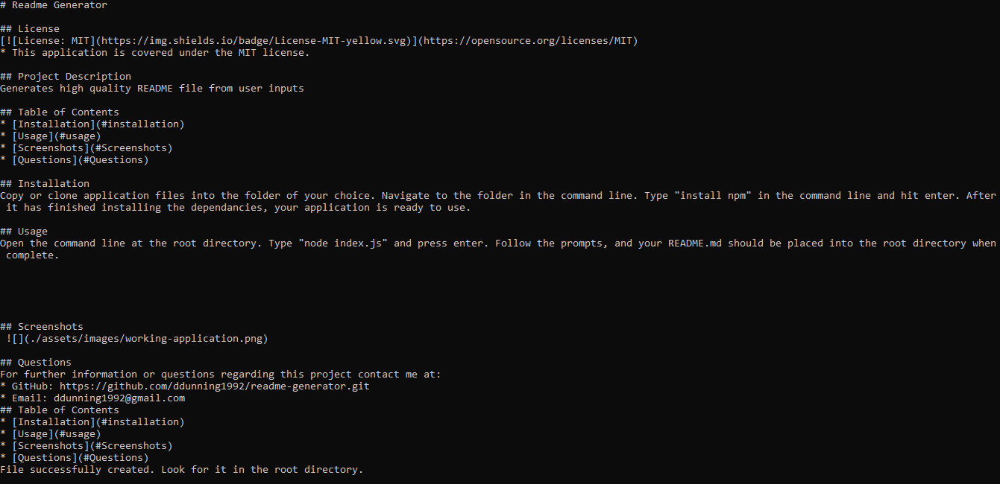

# Readme Generator

## License

* This application is covered under the MIT license.

## Project Description
Generates high quality README file from user inputs
    
## Table of Contents
* [Installation](#installation)
* [Usage](#usage)
* [Screenshots](#screenshots)
* [Questions](#questions)
    
## Installation
Copy or clone application files into the folder of your choice. Navigate to the folder in the command line. Type "install npm" in the command line and hit enter. After it has finished installing the dependancies, your application is ready to use.
    
## Usage
Open the command line at the root directory. Type "node index.js" and press enter. Follow the prompts, and your README.md should be placed into the root directory when complete.

https://watch.screencastify.com/v/Ne7TVTl3BrOc8ksY5NR5
    

    

## Screenshots
 
    
## Questions
For further information or questions regarding this project contact me at:
* GitHub: https://github.com/ddunning1992/readme-generator.git
* Email: ddunning1992@gmail.com
## Table of Contents
* [Installation](#installation)
* [Usage](#usage)
* [Screenshots](#Screenshots)
* [Questions](#Questions)